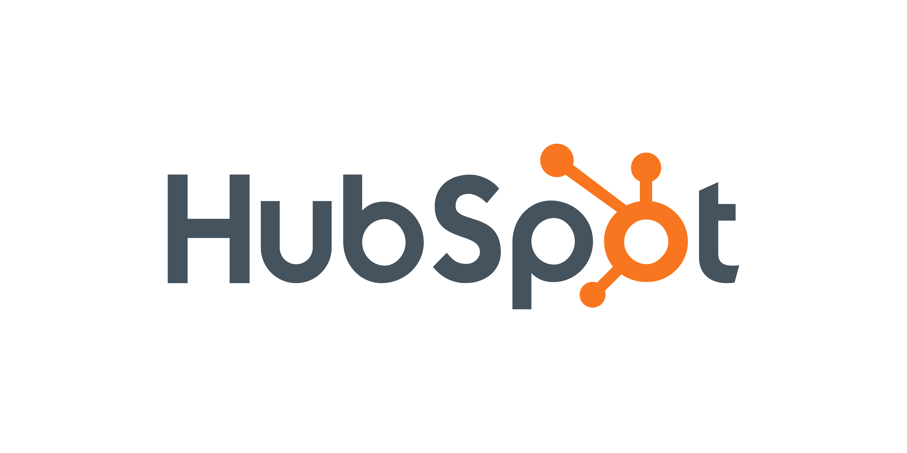

Are you looking for the best solution for your business? It’s not an easy task to find one that can manage marketing, sales and customer service at once, which is why we’re here to guide you through the 6 best HubSpot features for your company — whether it’s a small or a big one — so that you can elevate your strategies in 2024.

Although this CMS can brag about having amazing features, each better than the last one, we want to focus on the 6 best HubSpot features you don’t want to miss out. All set? Let’s go!

## What HubSpot Is Really About

As you may already know, HubSpot is, in a few words, an all-in-one platform that was designed for businesses as a marketing, sales, customer service and content management solution. Thanks to the wide range of tools you can get access to, you’ll be able to attract, engage and please your customers since they step a foot in your website.

However, not everyone fully understands the possibilities HubSpot has, which is why we wanted to make this brief guide for you to understand how much you can benefit from it. Without further delay, let’ start exploring the 8 best HubSpot features.

## HubSpot CRM

The root HubSpot stands in is, essentially, its [powerful CRM](https://www.hubspot.com/products/crm). If you don’t know what this is about, let us make it simple: this tool will allow you to manage customer interactions, information and communication. This integration allows a seamless collaboration between sales and marketing teams (if you have them), which is essential for a better data sharing between both of them

Apart from this, HubSpot Marketing Hub (where it’s included the CRM) enables the creation of Salesforce custom objects, that is, your marketing team will be able to create and manage these objects (like leads, opportunities, accounts, etc.) from within HubSpot.

## AI Content Optimization

We’ve been experiencing great progress these past years when it comes to technology, so no wonder a tool like HubSpot also wanted to stay updated and offer their clients the best solutions. Thanks to its [AI-powered content optimization](https://www.hubspot.com/products/artificial-intelligence#below-header-breeze_wf_header_splash), you can get help with blog posts, landing pages, and website content so that you [achieve a good SEO](/blog/seo-optimization-for-search-engines/) prospect and engagement; for example, you’ll be getting suggestions about keywords, readability, content structure and so on.

Let’s be honest: a little AI never hurt nobody. The thing is you use this kind of tool as a helper, not a builder, and take advice from it whenever you feel it’s a good one. Remember, we are the ones who know what they’re doing, so we should never entirely trust something like our business to a machine.

## Marketing Automation

Did anyone say something about time-saving? This HubSpot’s tool is one of the clients’ favorites because it [automates repetitive marketing tasks](https://www.hubspot.com/products/marketing/marketing-automation-information) like newsletters, social media posting or nurturing workflows. Regarding the last one, you’ll be able to create sophisticated workflows that guide leads all along the buyer’s journey.

To sum up, this means you’ll be saving time and improving your efficiency, which is essential during the first stages of building a business from scratch.

## Personalized Content

When it comes to compare personalization on CMS platforms such as HubSpot, Squarespace or WordPress, is the last one who takes the first place. Nevertheless, HubSpot Marketing Hub is really taking things seriously and getting their act together so that they can reach that position and dethrone WordPress once and for all.

But how are they doing so? Thanks to their reporting and analytics feature, your business will be collecting data and insights on what is it that your audience wants or prefers. Then, with all this information HubSpot’s Marketing Hub will offer you [advanced personalization options](https://knowledge.hubspot.com/website-pages/personalize-your-content) so that you can create customized content tailored to each customer’s unique interests and needs.

## Video Marketing Capabilities

If you’re planning on having audiovisual content on your website, such as marketing videos, then you’re going to love this feature. HubSpot Marketing Hub comes with these [video marketing capabilities](https://www.hubspot.com/products/video-hosting) we’d like to share with you, such as embedding videos on your landing pages or your newsletters and helping with analytics and tracking views, engagement rates and the general success of your efforts.

Apart from this, there’s also the possibility of personalizing this kind of content depending on your viewer’s profile, that is, come up with personalized content that satisfies their specific needs or interests.

## Social Media Advertising

We’ve nearly covered the 6 features we wanted to present to you today, but there’s one which is becoming more important over the years and that’s [social media advertising](https://www.hubspot.com/products/marketing/social-inbox). Where does your audience spend most of their time? That’s it, in social media, so that’s where you should be focusing your marketing strategies. Thanks to HubSpot and its Marketing Hub, you’ll be able to create, launch and monitor social media ad campaigns without leaving the platform.

What does this imply? You can merge your marketing campaigns (newsletters, lead generation, CRM strategies and so on) with your presence on social media without sacrificing an efficient tracking or management of your overall campaigns.

## Why You Should Try HubSpot

If you’ve come all this way and you’re still wondering why you should be choosing HubSpot for your business solutions, we won’t let you be in doubt. This all-in-one solution is not only a user-friendly and comprehensive one, but it’s also designed to grow with your business, which means it offers pricing for every budget, from small businesses to huge companies who want the full package.

Additionally, all these features about marketing automation, a centralized CRM system, AI-powered tools and its strong ecosystem only make your life easier — or your employees in case you outsource this kind of tasks — as they simplify business processes and provide the tools you’re going to be needing as your project starts to grow.
