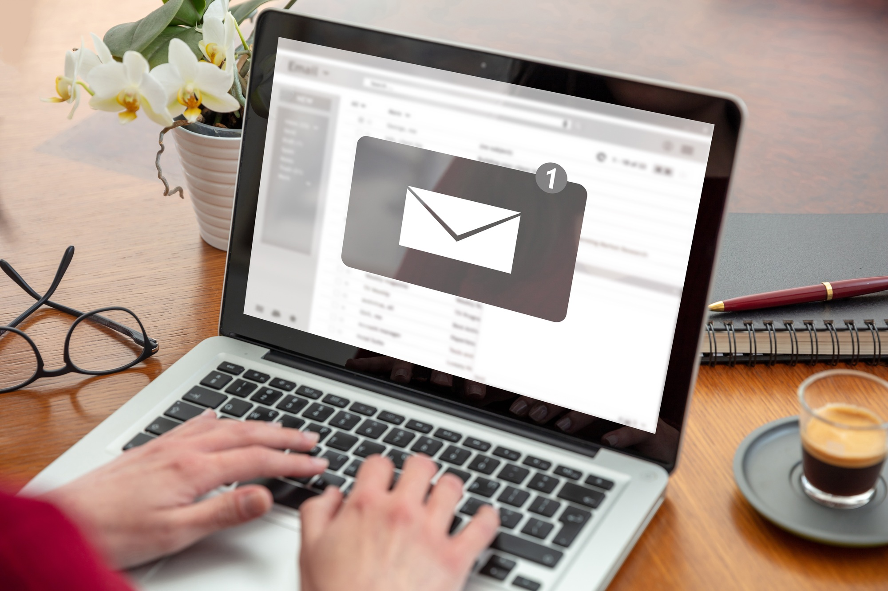
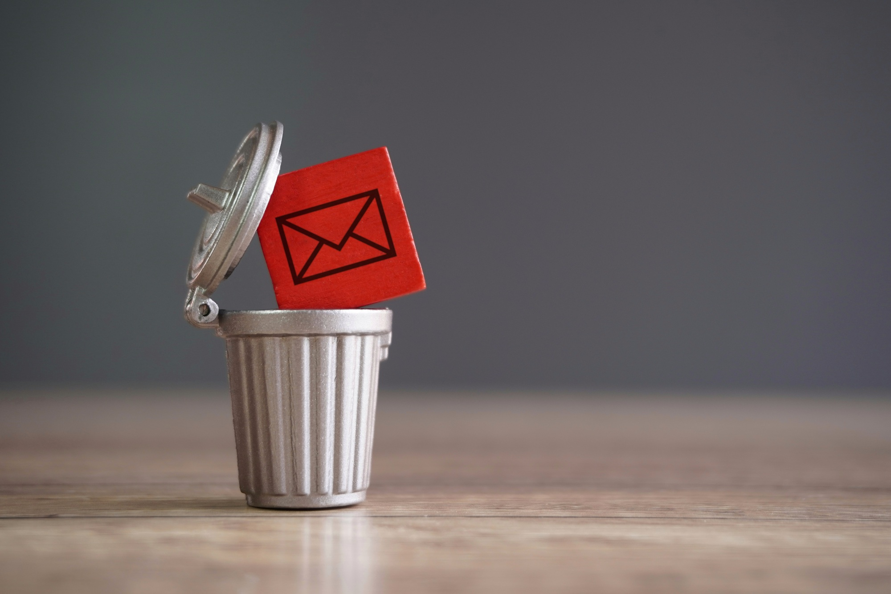
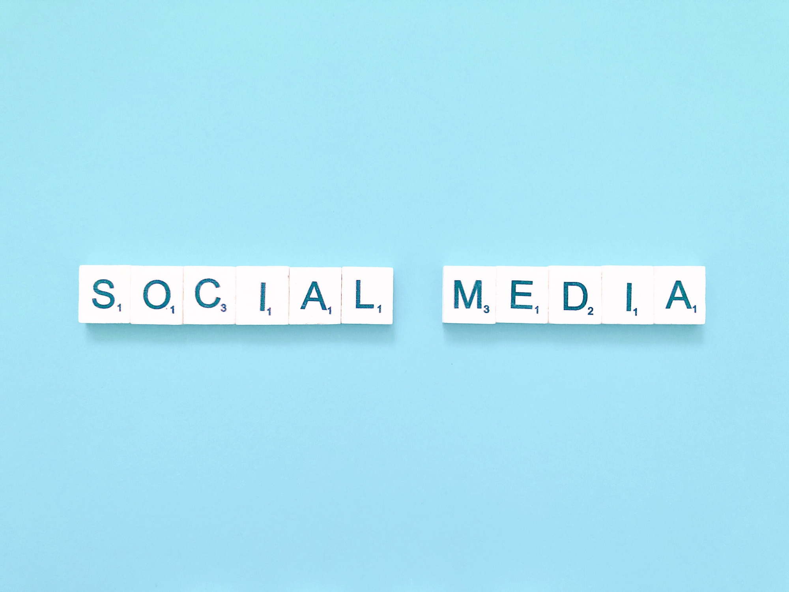
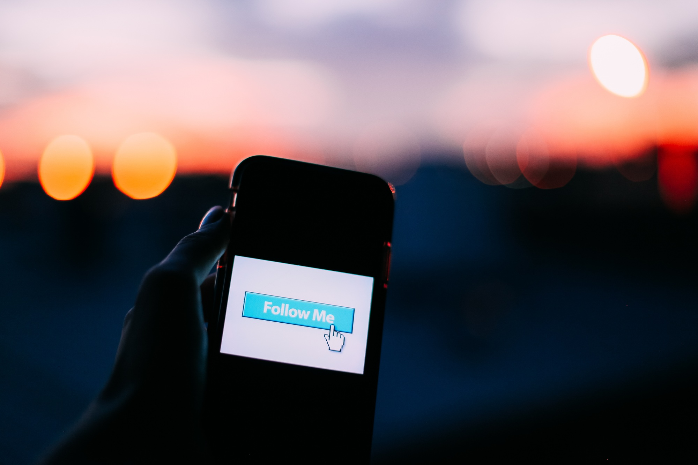

Are you still asking your visitors to subscribe to your newsletter? Do you really spend that much time preparing those emails not to get as many opens and clicks as you should? We live in the 21st century, people only subscribe to newsletters to get promo codes and if they don’t see immediate value, they unsubscribe or ignore your emails altogether.

In this article, we’ll show you why it’s time to stop wasting energy on getting visitors to subscribe to your email subscription. Plus, we’ll share some simple and effective alternatives to connect with your audience and keep them returning to your site for more.

## 5 reasons why you should stop asking your visitors to subscribe to your newsletter

In a world where attention spans are shrinking and inboxes are overflowing, relying on newsletter subscriptions as your main engagement strategy might not be as effective as you think. It’s time to rethink how you connect with your audience and explore more modern, efficient ways to foster engagement.

But if you’re still convinced that email subscriptions are the way to go, here are six reasons that might change your mind.

### It’s spammy

Asking people to subscribe to your email list can feel really spammy. You probably have a pop-up (let’s face it, everyone hates those—we don’t recommend them at all) or tons of forms all over your site that make you look desperate for subscribers. Seriously, doesn’t it seem a little shady to push so hard for people to sign up?

We get why you might feel the pressure. There are so many sites out there offering similar content, and it’s easy to worry about getting lost in the crowd. But here’s the thing: if you create awesome, engaging content, you don’t have to stress. **Your audience will come back** because they like what you’re putting out there.

Instead of annoying people with pop-ups and forms, focus on building trust and giving them value. If they love your stuff, they’ll find ways to follow you, whether that’s on social media or other platforms. No need to be pushy—let your content do the work!

### None reads them

Let’s be real—**most people don’t actually read newsletters**. They might sign up for a discount code or because they’re curious, but after that? Your emails are either ignored, sent straight to the spam folder, or deleted without a second glance.

Think about your own inbox. How often do you actually open newsletters, let alone read them from start to finish? People are overwhelmed with emails these days, and unless yours stands out in a big way (which is rare), it’s just more noise.

### At the end, people always unsubscribe to them

No matter how hard you try, the reality is that most people will eventually unsubscribe from your email list or worse, stop reading what you send to them. They might sign up out of curiosity, but over time, they’ll **lose interest or get overwhelmed** by the constant stream of emails.

It’s frustrating, but it’s a common pattern. Even if your content is solid, subscribers will often drop off once they’ve seen it a few times or if they feel like they’re not getting enough value. Plus, when people start receiving too many emails, they’re more likely to unsubscribe, marking your messages as spam or blocking you entirely.

### They will take you lots of time with not-so-good results

Preparing newsletters, setting up your site to collect new contacts, managing unsubscribed users, and paying for the platform to send your emails—email subscriptions **require a lot of time and effort**. From crafting the content to designing templates and scheduling campaigns, the entire process can feel like a full-time job.

On top of that, the results often don’t justify the effort. **Open rates are typically low**, click-through rates even lower, and many of your emails might end up in spam folders or go completely unnoticed. While email marketing can work for some businesses, for most projects, the time, money, and energy spent on this strategy simply aren’t worth it compared to other, more effective methods of audience engagement. Consider redirecting those efforts to platforms or tools that offer better results or even working on your [keyword research](/blog/make-the-perfect-keywords-research/) or improving your [page speed instead](/blog/page-speed-and-seo-2024/).

### There are better alternatives available

There are plenty of better ways to reach your audience than email subscriptions. As we mentioned earlier, open rates continue to drop, and many users perceive email newsletters as spammy. With [social media platforms still growing](https://explodingtopics.com/blog/future-of-social-media) and new ones constantly gaining users, these channels offer a fresh, non-intrusive way to share your project.

Social media allows you to **engage with your audience where they already spend their time**. You can create posts, stories, or reels that showcase your content in a way that feels natural and engaging. Platforms like Instagram, Twitter (X), and TikTok even let your audience opt-in for notifications, ensuring they see your updates if they want to. These alternatives not only help you maintain a positive connection with your audience but can also reach a far wider group than traditional email ever could.

## What should you do instead?

As we have already mentioned, instead of focusing on getting email subscriptions, you should change your marketing strategy. Stop wasting time on email lists and try this:

### Ask your audience to follow you on social media platforms

Rather than asking people to sign up for newsletters, encourage them to follow you on social media. Platforms like Instagram, LinkedIn, TikTok, or X ([best known as Twitter](https://buffer.com/social-media-terms/x-app)) allow you to reach your audience where they already spend their time. Plus, these platforms make it easy for your followers to engage with your content, comment, and share, expanding your reach. You can also use notifications, stories, and other interactive features to keep your audience updated without bombarding their inboxes.

## Conclusion

You are not the only one sending newsletters to clients or readers and it’s quite annoying to have an inbox with hundreds of newsletters you already forget about why you subscribe to them in the first place. Right now, we live in a time of social networks where people actually spend lots of time on them. Focus on creating good content on LinkedIn, Instagram, or even X, you will gain a better community and better performance and, in the end, you will be less annoying for your audience than sending a newsletter once a week.

Wishing You Joy and Warmth This Holiday Season \
Thank you for reading, and here’s to a bright new year ahead! \
With gratitude, \
The FreshJuice Team
