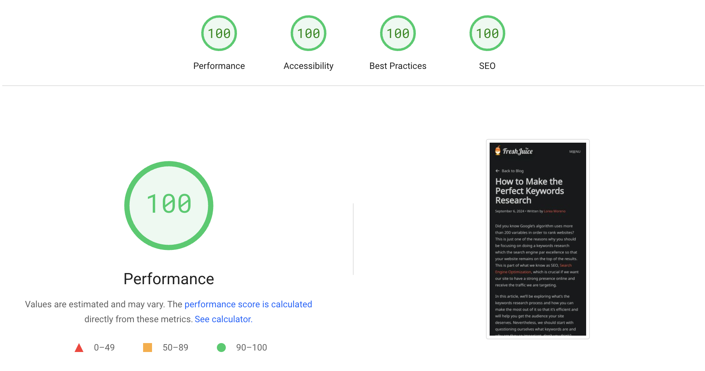

Owning a website also means taking care of the smallest details, such as page speed and SEO, something you may overlook if you’re not that documented about [search engine optimization](/blog/seo-optimization-for-search-engines/) and positioning. If you want to build a website and attract more traffic, you’re going to need to get familiar with concepts such as user experience, conversion rates, page speed insights and, of course, SEO.

Regarding this article, we’ll be exploring how page speed can affect your website’s presence online and how you can both check and improve it in order to get better rankings and retain your audience’s interest.

## What Exactly is Page Speed

First things first: what is page speed and why does it affect your site’s ranking? In simple words, page speed is the time it takes for a page on a website to load, but this is measured based on different elements, which are:

- **[Time To First Byte (TTFB)](https://web.dev/ttfb/).** In the first place, this concept refers to the time it takes to load the very first byte of information you’re showing on your website. When this time is short, it means the server is working fast.
- **[Time To Interactive (TTI)](https://web.dev/tti/).** Can you imagine what does the TTI measure? Yes, the time that goes by when you use an interactive element and there’s a response. When these times are high, it may be a Javascript issue.
- **[First Contentful Paint (FCP)](https://web.dev/fcp/).** You probably wouldn’t guess what this means unless someone explained it to you, so let’s do exactly that. FCP makes reference to the time it takes for the first element of content (which can be text, an image, svg and so on) to load on your website. [Learn more about the First Contentful Paint metric](https://developer.chrome.com/docs/lighthouse/performance/first-contentful-paint/).
- **[Total Blocking Time (TBT)](https://web.dev/tbt/).** This metric measures the total amount of time between First Contentful Paint and Time to Interactive, which is the time it takes for a page to become interactive. This is important because it measures how long a page is unresponsive to user input. [Learn more about the Total Blocking Time metric](https://developer.chrome.com/docs/lighthouse/performance/lighthouse-total-blocking-time/).
- **[Cumulative Layout Shift (CLS)](https://web.dev/cls/).** This metric measures the visual stability of a page. In other words, it measures how much elements on a page move around while the page is loading. This is important because it measures how much a page layout shifts while the page is loading.
- **Full Load Time.** Load time is, generally speaking, the amount of time your page needs to load fully including all its elements, whether they are interactive buttons, text, images, videos, etc.
- **[Interaction to Next Paint (INP)](https://web.dev/inp/).** As a part of Google’s goal to improve user experience on websites, they’ve recently come up with a new performance metric called INP (Interaction to Next Paint). This measures how responsive a webpage is by tracking the latency of actions such as clicks, taps or keyboard inputs. In a few words, this metric studies how long does it take to a site for responding to this kind of inputs.
- **Mobile Goes First.** Last, but not least, you need to keep in mind how important it is for page speed measurement your page’s performance when it comes to using a device such as a mobile device. In a few words, the measurement tool is going to take into account this performance before the desktop one.

## Page Speed and SEO: How Are They Connected

Now that you know what elements page speed measurement takes into account, it’s time to know how this affects your site’s SEO and presence on SERPs (Search Engine Results Page). At the beginning, we were speaking of concepts such as user experience or conversion rates, which are easy to understand once you get familiar with SEO and website output.

That said, let’s scout these concepts in order to better understand how important they are for your site’s success and possibilities of ranking on SERPs, which is essential nowadays if you wish to be noticed on the internet.

### SEO

Now that we know what page speed is and its significance for your site’s presence online, let’s see how SEO can be influenced by it and what does it take into account when ranking your website for — or other search engines — results.

When it comes to positioning your website on the results page, Google takes into account your page speed to see if that’s something the audience is going to like. If your website has long waiting times or doesn’t load images and other content in just a matter of seconds, that’s something it’s going to back out many people, who otherwise may’ve stayed on your site. In the end, both Google and other search engines look for websites which are relevant, appropriate and, above all, fast and well-structured.

### Conversion Rates

In a context of page speed, conversion rates refers to how many visitors of your website complete a desired action, that is, if they end up making a purchase or signing up for a newsletter, for example. Page speed, as you can imagine, affects this rate directly, as no one wants to stay in a slow website where you can’t even click on a button and make it work.

In the end, the faster your website loads its content, the more likely visitors are to stay and, if applicable, make a purchase. There are many studies that show users expect loading times of 2 or 3 seconds or otherwise they tend to abandon those websites, specially if we think of mobile devices. Here these waiting times are even shorter, as mobile users are more likely to be on the go and more impatient when it comes to delays.

### User Experience

You should already see that users’ satisfaction is the most important thing for Google when ranking your website, which is reason enough for taking special care of user experience. If we want to beat the algorithm and be what Google (and other search engines) expects us to be, first we need to understand one or two things like, for example, the fact that people normally have an attention span of a couple of seconds — if your website has a loading time higher than 3 seconds, as we mentioned before, consider it a failure.

That said, you must improve your website and make sure you include a great user experience so that search engines rank it higher on SERP above others that, although they may have lower bounce rates, aren’t as well-optimized for user experience as yours is.

## How Can I Check My Website Speed

Are you about to start a project that will need a functional website which attracts and retains traffic? Once you’ve set it and think it’s time for it to see the light, one of the first things you should check is its speed, but how can you do that? There are several tools and methods to know more about your site’s insights when it comes to load times, performance metrics and recommendations for improvement, so let’s take a look at some of them:

- **Google PageSpeed Insights.** If you’re trying to rank high on Google, shouldn’t you be using a tool of their own? You can try [Google’s PageSpeed Insights](https://pagespeed.web.dev/), that analyzes both mobile and desktop versions of a website, and get key metrics such as LCP (Largest Contentful Paint), FID (First Input Delay) or CLS (Cumulative Layout Shift). In case you’re wondering, this tool is free and also scores that impact SEO.
- **Pingdom Website Speed Test.** Another of our favorite tools when it comes to check a website’s speed is [Pingdom](https://tools.pingdom.com/), which is easy to use and displays simple results so that everyone can identify the issues without being an expert. You’ll be able to check load time and performance grade, apart from selecting different geographic regions for testing and simulating how users may experience your site.
- **GTmetrix Site Speed Checker.** Last, but not least, take a moment to check this quite interesting tool for checking your website’s speed and metrics, [GTmetrix](https://gtmetrix.com/). It offers actionable recommendations and provides a detailed report on your site’s time loads, specifying which are the factor contributing to slower speeds.

## To-Do List for Improving Your Page Speed and SEO

All set for being the #1 result on Google? Before we leave you to it, shall we go over the key points when improving your website’s page speed? Take it as a summary so that you can come back to this article and make sure you’re following all the necessary steps. These would be:

- **Getting a good host.** It’s no use having a well-optimized and fast website if it’s being hosted by a slow server. For example, if you’re aiming for a certain audience from a certain place, you should be choosing a server which operates in the same country.
- **Static site generation.** Instead of having a website that generates dynamically on the fly, you should consider having one where all the pages are pre-built into simple and static files, such as HTML ones. This means when a user accesses your website, they’ll be using the static HTML instead of having to load the entire CMS and the code it comes with it.
- **Reduce elements’ size.** Finally, another thing that really slows down a website is, obviously, elements such as images or videos. If you want to improve your page speed, make sure you reduce the size of the files you’re willing to use on your website, for example, with tools such as [iLoveIMG](https://www.iloveimg.com/), [TinyPNG](https://tinypng.com/), [ShortPixel](https://shortpixel.com/online-image-compression), or [Compressor.io](https://compressor.io/).
