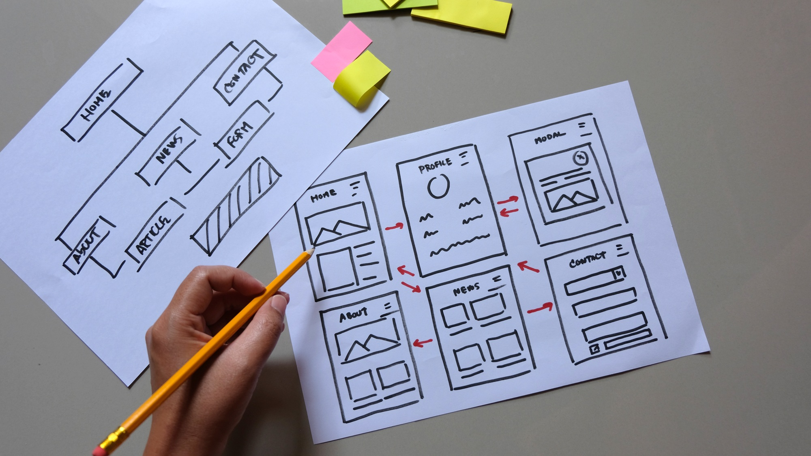

Landing pages are an excellent tool for achieving your marketing goals, such as driving conversions, generating leads, encouraging newsletter sign-ups, or promoting product sales. Their focused design can significantly **boost conversions and provide measurable results**. However, because landing pages have a closed-loop structure, it’s crucial to ensure their design and elements are both appealing and persuasive to effectively achieve your objectives.

In this article, we’ll guide you through crafting a persuasive landing page by incorporating six essential elements, along with practical tips to maximize its performance.

## How to Create the Best Landing Page for Your Website

Creating an engaging and persuasive landing page is easier than it seems. The key is to keep the structure simple and concise. Think of a landing page as a teaser for your product—like a hook that draws users in, with the call-to-action (CTA) being the moment where they claim their reward and you achieve your goal. To make it effective, focus on sharing just enough information to spark curiosity and compel users to take action.

Follow these simple steps to craft an effective landing page:

1. **Set Your Goal:** Clearly define the purpose of your landing page. Whether it’s generating leads, driving sales, or encouraging sign-ups, your goal will shape the structure and content. Understanding your objective will also help you identify the essential information to include.
2. **Keep It Short:** Brevity is key to an impactful landing page. Avoid overwhelming users with too much information. Instead, focus on selecting the right words and visuals that capture attention and convey your message effectively.
3. **Structure It Well:** Visual appeal plays a critical role in engaging users. Organize your content with clear headings, compelling copy, and prominent CTAs. Ensure the layout is clean and guides users seamlessly toward the desired action.

These three foundational steps are essential for creating a high-performing landing page but they are not the only thing to do or add in them…

## 6 Components You Need to Add to Create a Persuasive Landing Page

We know—the instructions we provided earlier might feel a bit general. But don’t worry! As we mentioned earlier, we’re here to share the exact components every persuasive landing page needs.

There are six key elements, and we have listed them in the order they should appear on your landing page.

### A persuasive headline

First impressions count, and your headline is the very first thing visitors will notice. It should be clear, engaging, and directly address the visitor’s needs or pain points. A well-crafted headline grabs attention instantly and makes visitors want to explore further.

### A form

This is the most important element, and its placement is key. When creating a landing page, always include a form immediately after the headline. Keep the form short and straightforward—ask only for the information you truly need. The easier it is for users to complete, the more likely they are to engage.

### High-quality content

It’s logical but crucial: to convince your visitors, you need high-quality content. Your messaging should be concise, persuasive, and aligned with your audience’s needs. Avoid overwhelming them with too much information—focus on delivering value while keeping it simple.

### Supporting visuals

To make your landing page more engaging, always include visuals that complement the content. Eye-catching images or videos can effectively convey your message and make the page more appealing. Use visuals and color schemes that align with your brand identity for a cohesive experience.

### Testimonials

Boost your conversion rate by including trust signals like testimonials from satisfied customers or clients. Reviews, case studies, or even logos of well-known brands you’ve worked with can add credibility. Security badges and guarantees can also help build trust with your audience.

### FAQ

This element is optional but highly beneficial. Adding a FAQ section with real, frequently asked questions can address any doubts or concerns visitors might have. This not only saves them time but also helps reduce hesitation, making them more likely to take action. A well-thought-out FAQ section can be the final push that turns visitors into leads or customers. Moreover, integrating the FAQ into your [schema markup](/blog/why-schema-markup-is-important/) can further enhance conversions and boost SEO.

## Other things to take into account when creating a persuasive landing page

In addition to incorporating the six essential components, there are a few other strategies that can further enhance the effectiveness of your landing page and help you achieve even more conversions.

- **Always Create Responsive Pages:** While many of us still use desktops, the majority of users now access the internet through mobile devices like phones or tablets. In fact, over 50% of web traffic comes from mobile users. That’s why designing responsive landing pages that adapt seamlessly to any screen size is absolutely crucial.
- **Conduct A/B Testing:** Rarely does a landing page achieve perfection on the first try. [A/B testing](https://www.mida.so/blog/ab-testing-fully-explained) allows you to compare different versions of your page to determine which design, copy, or CTA resonates best with your audience. Testing is key to [optimizing performance](/blog/seo-optimization-for-search-engines/) and maximizing conversions.

By keeping these additional tips in mind and fine-tuning your approach, you can create a landing page that not only captures attention but also drives meaningful results.
