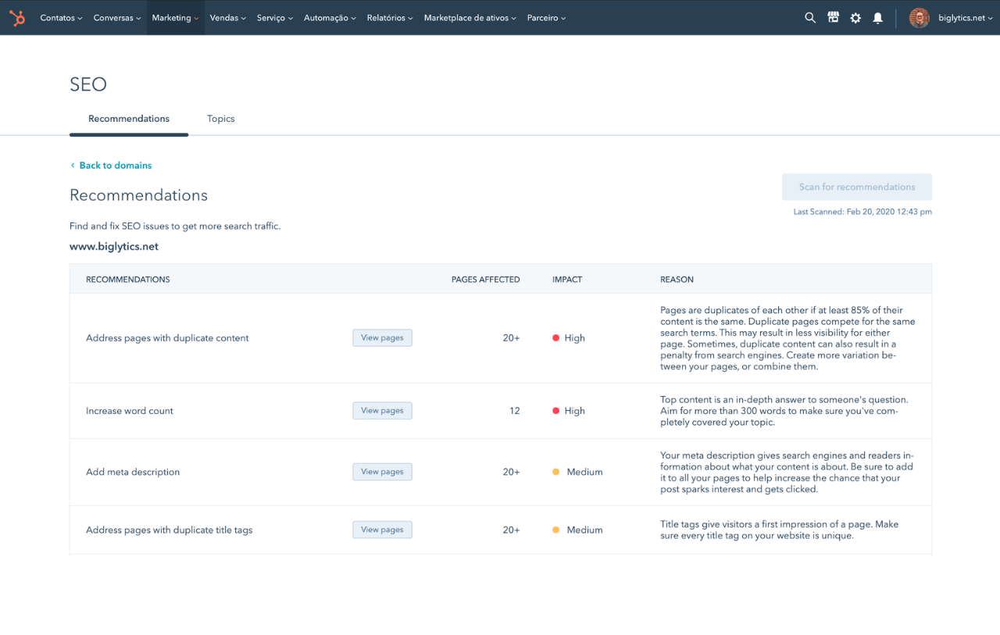
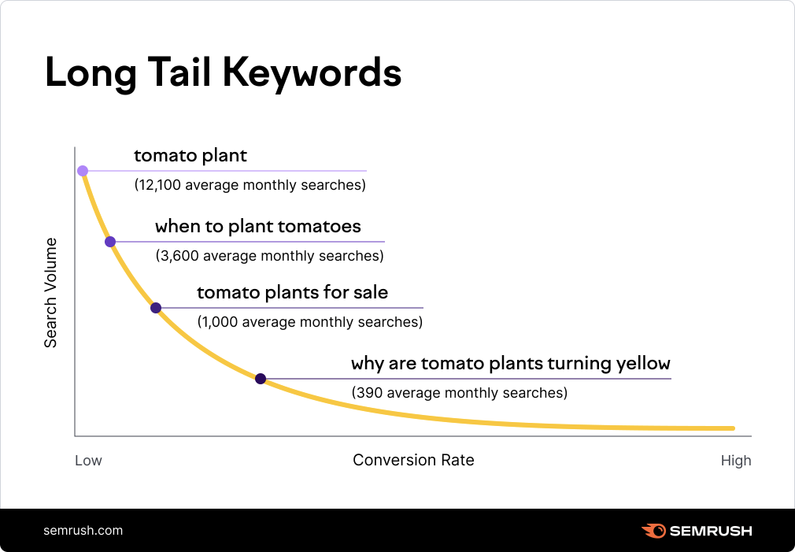

Starting a business these days means, necessarily, having a presence online. But this goes further than having an Instagram where you show some of your products or you speak about subjects related to your startup — it’s about having a strong foundation which attracts more customers.

That said, we’ve come up with this quick guide where we’ve put together 5 tips regarding HubSpot and SEO for startups so that you can set up your business up for long-term success and get the most out of a powerful tool such as HubSpot.

## HubSpot and SEO for Startups: Road to Success

If you’ve decided to build a startup, you surely know you’re currently competing with others and even established brands, so you can’t waste any time — nor money — on wrong or passive strategies for your business. In case you don’t know, SEO (Search Engine Optimization) is one of the most cost-effective ways for companies to drive organic traffic and build a strong presence online, which is why you should be learning about this as much as possible.

Thanks to an all-in-one marketing platform such as HubSpot, you don’t have to be an expert in order to implement these [SEO strategies](https://www.hubspot.com/products/marketing/seo) efficiently, even if you see yourself limited by time and resources — specially in the beginning. Having this on the table, how about we walk you through this 5 key ways guide to use HubSpot and SEO for Startups?

## 1️⃣ Optimization

This platform has [so much to offer](/blog/6-best-hubspot-features-for-business/) and, among all functionalities, we most definitely have to highlight its SEO section. HubSpot’s built-in SEO tools will help you simplify the optimization process without needing a dedicated team for this — maybe you can’t afford that yet. You’ll find features such as keyword research, content optimization recommendations and site audits for you to both identify opportunities and fix issues as soon as possible.

For example, among the recommendations this SEO tools offers both startups and big companies there are steps to improve on-page SEO which you will easily understand and be able to implement on your site (meta tags, internal links or readability). Trust us when we tell you that, by making use of these tools, you’ll see how your business becomes more search-engine-friendly.

<figure>
  
  <figcaption>Image from https://www.hubspot.com/products/marketing/seo</figcaption>
</figure>

## 2️⃣ Long-Tail Keywords

Whether you know about SEO strategies or not, you must have heard about keywords and their significance when it comes to having a strong presence online. Nowadays, with large brands and companies dominating the internet, it can be difficult to rank for highly competitive keywords, so startups should then focus on long-tail keywords, which are niche phrases with lower competition but higher intent.

Let’s set an example: instead of using a keyword like “marketing software”, aim for something more like “affordable marketing software for small businesses”. Again, with HubSpot’s keyword research tool you’ll find it easy to get ideas and study volume, competition level or related terms.

<figure>
  
  <figcaption>Image from https://semrush.com/kb/685-what-are-long-tailed-keywords</figcaption>
</figure>

## 3️⃣ Content That Converts

Okay, so what if you don’t know what to write about on your website? This can absolutely happen, specially if you’re more of a business person — or group of people — rather than a creative one. This is what HubSpot’s content strategy was created for, a tool with which you’ll be able not only to create content, but also optimize it so that it ranks on search engines. Any website aiming for first positions should have blog posts, landing pages and pillar content that can answer its clients’ questions and doubts.

Based on your keywords research, HubSpot will help you plan topics and ensure you include meta descriptions, have optimized headings and add internal — and external — links. If you manage to keep publishing SEO-optimized content, you’ll have a startup with authority and organic traffic over time.

## 4️⃣ Technical SEO Issues

Let’s say you now have a website that includes posts, landing pages and pillar content and you’ve taken care of SEO strategies, but what about those issues we tend to overlook? For example, have you ever visited an extremely slow site that has made you abandon it immediately? This is what we’re talking about here.

When creating a website for our business, we tend to overlook issues like broken links, slow page speeds and poor mobile optimization, which can hurt your rankings monumentally. HubSpot has a site audit tool that will scan your website searching for this kind of techical issues and will provide a detailed report so that you can take action and fix them. Missing alt text? Found it. Duplicated content? Found it.

## 5️⃣ SEO Analysis

Last, but not least, you’ll have to know if everything you’ve learned and implemented about HubSpot and SEO for startups is working, and that you can double-check it with HubSpot’s analytics tool. Here you’ll find insights into organic traffic, keyword rankings and conversion rates, as well as examples of posts that are driving the most traffic to your website or the keywords which are leading to conversions.

Depending on your business growth, HubSpot can also grow with it — by choosing a more advanced plan that allows you to continuously monitor and refine your SEO efforts. Nevertheless, taking all these things into account and implementing them on your startup’s site will lead to a strong foundation, even if you’re starting with a resource-strapped team.
