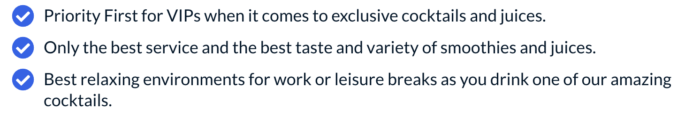

The List module provides a way to create and manage a list of items. Features include customisable text and its appearance, along with customisable icons.

You can check the [demo page here](https://143910617.hs-sites-eu1.com/module-list)

## Settings

### Toggle List

- **Enable Rich Text**: Replaces the default text field with a rich text editor.
- **Enable Global Icons**: (Toggled on default) Allows you to select an icon from the global icon used in your list.
- **Enable Global Icon Color**: (Toggled on default) Allows you to select a color for the global icon used in your list.

### List Items

Every item from List Items has the following customizable settings:

- **Item Text**: The text that will be displayed in the list. When Rich text is enabled, this setting is replaced by **Item Rich Text**. The same as normal text, except its a rich text editor.
- **Individual Icon**: (When Global Icons disabled) Allows you to select an icon to be used only for that specific item from List Items.
- **Individual Icon Color**: (When Global Icon Color disabled) Allows you to select a color for the icon used only for that specific item from List Items.
