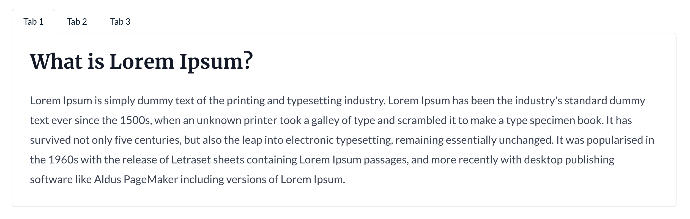

The Tabs module provides a simple way to create tabbed interfaces.

## Settings

- **Tabs List**: A list of tabs, each tab containing the following settings:
  - **Tab Name**: The name of the tab.
  - **Tab Content**: A rich text field containing the content for the tab.
