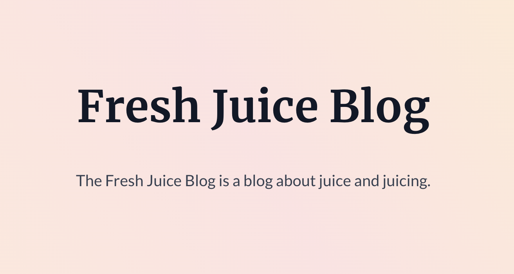
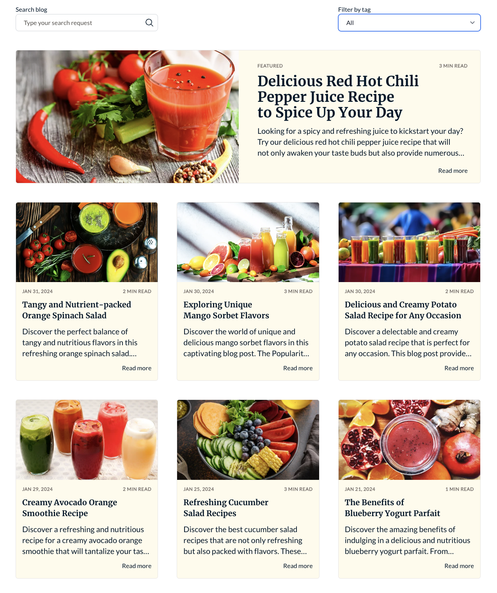

Blog Listing modules are used to display a list of blog posts on the page. These are all the components of Blog Listing.

These Modules can only be used in content type "BLOG_LISTING".

You can check the modules in action [here](https://143910617.hs-sites-eu1.com/blog)

---

## Blog Listing Hero

### Settings
- **Blog Name**: The name of your blog. You may also use the variable {{blog.name}} to dynamically display the blog name.
- **Blog Description**: The description or details for the blog page. You may also use the variable {{blog.description}} to dynamically display the blog description.
- **Blog Author Listing**: All settings related to the authors of the blog. These are the following settings available:
  - **Subheading**: The text before the headshot of the author. Default is "Posts by".
  - **Show Headshot?**: (Toggle) Option to show the headshot of the author.
  - **Show Social Profiles?**: (Toggle) Option to show the social media connections of the author.
- **Blog Tag Listing**: Displays the tags for the author about the content they create. Only has a single option, Subheading. Default is "Posts about".

---

## Blog Listing

### Settings
- **Blog**: The blog you want to display. You can select the blog from the dropdown list from our default blogs, or create your own.
- **Show Tags Filter?**: (Toggle) Option to filter blog posts in blog listing by their tags.
- **Show Search Bar?**: (Toggle) Option to filter blog posts in blog listing by search input.
- **Search Label Text**: The text above the search bar when Show Search Bar is enabled.
- **Search Placeholder Text**: The placeholder text inside the search bar when Show Search Bar is enabled.
- **Filter Label text**: The text above the tags filter dropdown when Show Tags Filter is enabled.
- **Filter Placeholder Text**: The placeholder text inside the tags filter dropdown when Show Tags Filter is enabled.
- **Show Featured Article?** (Toggle) Option to have a "featured article" at the top of blog listing that fills full width of the container.
- **Show Read Time?**: (Toggle) Option to display the estimated read time of the blog post.

---

## Pagination

This module has no settings.
