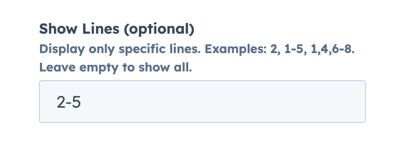

👉 [View module on HubSpot Marketplace](https://app.hubspot.com/l/ecosystem/marketplace/modules/code-snippet-github-gist-module-by-freshjuice)

The **Lite Video Embed** module allows you to embed YouTube or Vimeo videos in a performance-optimized way.
All settings are available in the **sidebar panel** when editing a page in HubSpot.

👉 [View module preview](https://demo.freshjuice.dev/modules/code-snippet-github-gist) — this is a HubSpot landing page showing the module in action. You can use it to test performance with tools like PageSpeed Insights.

---

## Content tab

### Gist Embed Code

Paste the GitHub Gist embed code here. This is the only required field — it loads the snippet from GitHub and renders it inside HubSpot.

<figure>
  
  <figcaption>Sidebar Gist Embed Code textarea.</figcaption>
</figure>

### File Name (optional)

If your Gist contains multiple files, specify the exact file you want to display. Leave blank to show the default file.

<figure>
  
  <figcaption>Sidebar File Name input.</figcaption>
</figure>

### Caption (optional)

Add a short caption above the code block. Great for labeling examples like “Example HTML snippet” or “Config.js sample.”

<figure>
  
  <figcaption>Sidebar Caption input.</figcaption>
</figure>

### Show Lines (optional)

Display only specific lines from the snippet. Examples: 2, 1-5, 1,4,6-8. Leave empty to show all lines.

<figure>
  
  <figcaption>Sidebar Show Lines toggle.</figcaption>
</figure>

## Highlight Lines (optional)

Highlight specific lines to draw attention to important parts of the snippet. Examples: 2, 1-5, 1,4,6-8.

<figure>
  
  <figcaption>Sidebar Highlight Lines input.</figcaption>
</figure>

## Advanced options

Expand the **Advanced** group in the sidebar:

- **Custom CSS Class** — add extra classes for targeting or styling.

<figure>
  
  <figcaption>Sidebar Custom CSS Class input.</figcaption>
</figure>

## Style tab

### Gist Style

- **Show Footer** - Toggle whether the footer (with file name and GitHub link) should be displayed.
- **Show Line Numbers** - Enable or disable line numbers in the code block.
- **Expand Hidden Lines** - Allow users to expand collapsed code blocks and view hidden lines.

<figure>
  
  <figcaption>Style tab options.</figcaption>
</figure>

### Appearance

- **Theme** – Choose between System (default), Light, or Dark themes. System adapts to the visitor’s OS preference.
- **Border Radius** – Round the corners of the code snippet (in pixels). Example: 3 adds subtle rounding.
- **Max-Width** – Set a maximum width (in pixels) for the snippet container. Example: **900** ensures the block fits your layout.
- **Alignment** – Align the code snippet within its container: **Left**, **Center**, or **Right**.

<figure>
  
  <figcaption>Style → Appearance options.</figcaption>
</figure>

---

Looking to install this module?\
👉 [Get Lite Video Embed on the HubSpot Marketplace](https://app.hubspot.com/l/ecosystem/marketplace/modules/code-snippet-github-gist-module-by-freshjuice)
