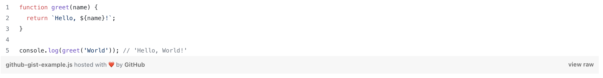
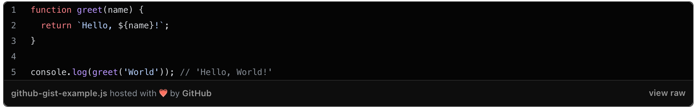

<figure>
  
  <figcaption>Light Mode Github Gist Module</figcaption>
</figure>

<figure>
  
  <figcaption>Dark Mode Github Gist Module</figcaption>
</figure>

The Github Gist module is a powerful tool that allows you to display specific files from any Git repository. This module is particularly useful for sharing code snippets, examples, or even entire files directly from your repositories.

Please note that the file must be publicly accessible.

You can check the [demo page here](https://143910617.hs-sites-eu1.com/module-github).

## Settings

- **Gist Embed Code or ID**: Used to display your github project/file. By ID it is meant for GistID to be used.
- **File name**: Enter a specific file name to display only one file from Gist.
- **Caption**: Description that will be shown above code.
- **Lines**: Show only specific lines of code. Example: "2", "1-5", "1,4", "1,4,6-8".
- **Lines Expanded**: (Toggle) Shortens the code snipped in the gist via adding a line of text in between elements, if clicked, it will expand showing the shortened code.
- **Highlight Lines**: Highlight specific code lines. Example: "2", "1-5", "1,4", "1,4,6-8".
- **Show Footer?**: (Toggle) Show footer section if toggled. Default is toggled.
- **Show Line Numbers?**: (Toggle) Show line numbers section. Default is toggled.
- **Theme**: Your preference for the module's theme. By default its set to System Default, but you can pick Light or Dark.
