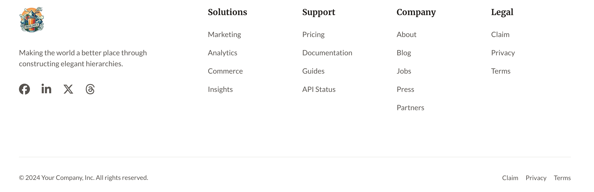
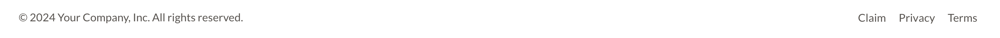

The Global Footer modules provide footers for pages and landing pages for your site.

You can check the demo page [here](https://143910617.hs-sites-eu1.com/module-global-footer)

## Global Footer

### Settings
- **Logo**: The logo of your choice for your website
- **About Company**: Text placed below the logo in your footer. Typically used for a company slogan.
- **Social Links**: Social Media icon links for your company / service. Every icon in Social Links has the following settings:
  - **Social Link**: The url to your social media account (e.g Facebook, Twitter, Threads etc.)
  - **Title**: The title for your social media icon link.
- **Footer Menu**: The footer menu includes links or options usually found at the bottom of a webpage for quick access to additional information or site navigation. You may create a new menu or modify the default one for more customisation.
- **Copyrights**: Rich text module where you insert your copyright policy (© 2024 Company Name. All rights Reserved, an example). You may use a dynamic year, by using '{{ year }}'.
- **Footer Legal Menu**: (Optional) The footer legal menu consists of links or options typically placed at the bottom of a webpage, providing access to legal information such as terms and conditions, privacy policies, and copyright notices.

---

## Global Footer Lp

This Global Footer Module is specifically designed for landing pages.

### Settings
- **Copyrights**: Rich text module where you insert your copyright policy (© 2024 Company Name. All rights Reserved, an example). You may use a dynamic year, by using '{{ year }}'.
- **Footer Legal Menu**: (Optional) The footer legal menu consists of links or options typically placed at the bottom of a webpage, providing access to legal information such as terms and conditions, privacy policies, and copyright notices.
