👉 [View module on HubSpot Marketplace](https://app.hubspot.com/l/ecosystem/marketplace/modules/lite-video-embed-module-by-freshjuice)

The **Lite Video Embed** module allows you to embed YouTube or Vimeo videos in a performance-optimized way.
All settings are available in the **sidebar panel** when editing a page in HubSpot.

👉 [View module preview](https://demo.freshjuice.dev/modules/lite-video-embed) — this is a HubSpot landing page showing the module in action. You can use it to test performance with tools like PageSpeed Insights.

---

## Content tab (video setup)

### Video Provider

Select your video platform (**YouTube** or **Vimeo**).

<figure>
  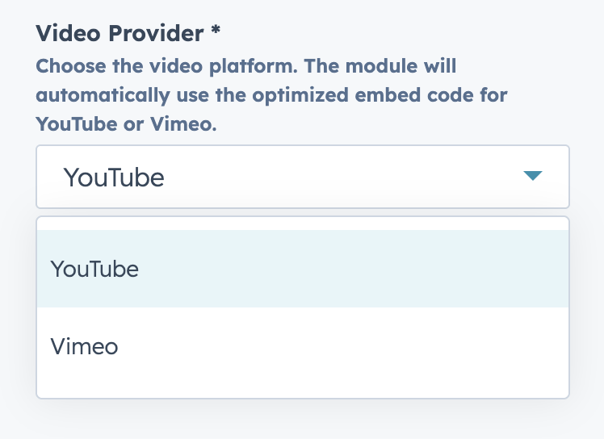
  <figcaption>Sidebar showing Video Provider dropdown.</figcaption>
</figure>

### Video ID / URL

Paste the full video link or just the video ID.

- Example YouTube: `https://www.youtube.com/watch?v=dQw4w9WgXcQ`
- Example Vimeo: `https://vimeo.com/861680818`

<figure>
  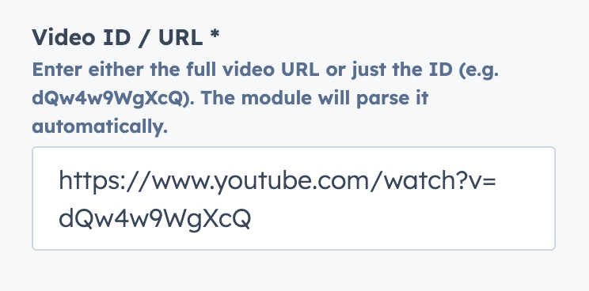
  <figcaption>Sidebar input with YouTube/Vimeo URL.</figcaption>
</figure>

### Title

Accessible label shown for the video. Default: **Play Video**.

<figure>
  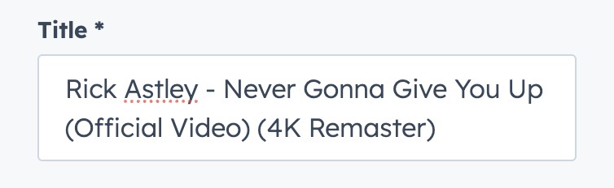
  <figcaption>Sidebar Title field.</figcaption>
</figure>

### Thumbnail (optional)

Upload a custom thumbnail or leave blank to use the platform’s preview.

<figure>
  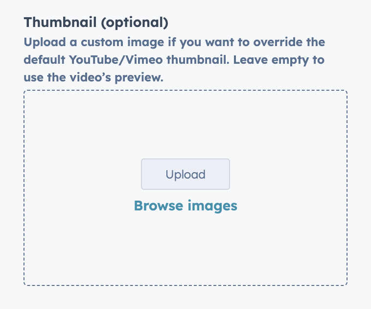
  <figcaption>Sidebar Thumbnail upload.</figcaption>
</figure>

## YouTube Player Setting (shown only when YouTube is selected)

- **Show controls** — display YouTube UI (playbar, buttons).
- **Show Fullscreen Button** — toggle fullscreen icon visibility.
- **Start** — start playback at a specific second (e.g., `30` → starts at 0:30).
- **End (optional)** — stop playback at a specific second (must be greater than Start).
- **Loop** — loop the video when it ends.
- **Access the YouTube Iframe Player API** — enable programmatic control (play/pause/seek/events).
  > ⚠️\
  > Enabling the JS API disables Privacy mode for YouTube (loads from `youtube.com` and may set cookies).

<figure>
  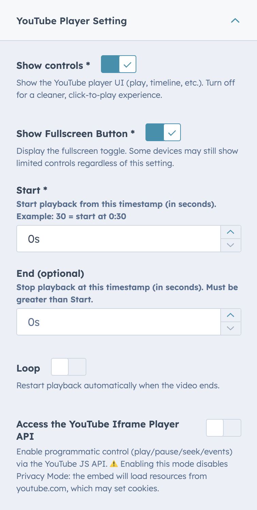
  <figcaption>Sidebar YouTube settings toggles/inputs.</figcaption>
</figure>

## Vimeo Player Settings (shown only when Vimeo is selected)

- **Show title** — display the video title.
- **Show byline** — display the creator byline.
- **Show portrait** — display the channel avatar.
- **Loop** — loop the video when it ends.
- **Accent color** — set the player’s accent color (e.g., `#ff9900`). Can inherit from theme’s primary color.
- **Private token / query (optional)** — append a private token or query (e.g., `h=abc123`) for unlisted/private videos.

<figure>
  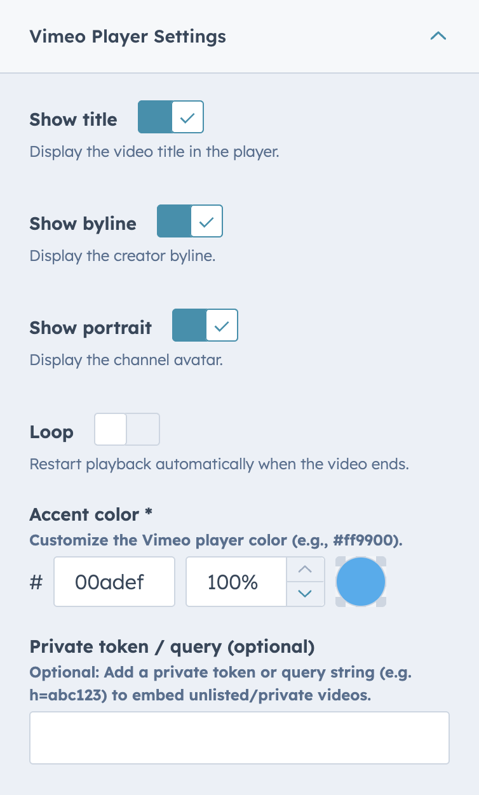
  <figcaption>Sidebar Vimeo settings with color picker and toggles.</figcaption>
</figure>

## Advanced options

Expand the **Advanced** group in the sidebar:

- **Custom CSS Class** — add extra classes for targeting or styling.
- **Privacy mode** — YouTube no-cookie embed / Vimeo limited tracking.
- **Enable Video SEO Schema** — injects structured data (VideoObject) into the page.

<figure>
  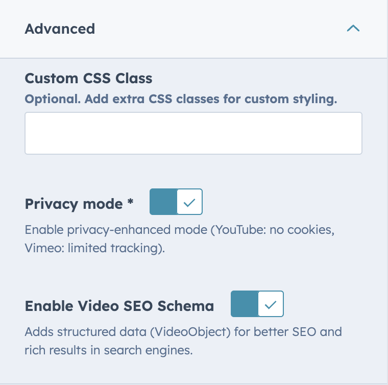
  <figcaption>Sidebar Advanced toggles expanded.</figcaption>
</figure>

#### Example SEO schema output

When enabled, the page will include JSON-LD markup like this:

```html
<script type="application/ld+json">
  {
    "@context": "https://schema.org",
    "@type": "VideoObject",
    "name": "Rick Astley - Never Gonna Give You Up (Official Video) (4K Remaster)",
    "description": "“Never Gonna Give You Up” was a global smash on its release in July 1987.",
    "thumbnailUrl": ["https://i.ytimg.com/vi/dQw4w9WgXcQ/maxresdefault.jpg"],
    "uploadDate": "1987-07-27T00:00:00+00:00",
    "inLanguage": "en",
    "embedUrl": "https://www.youtube-nocookie.com/embed/dQw4w9WgXcQ",
    "potentialAction": {
      "@type": "WatchAction",
      "target": "https://www.youtube-nocookie.com/embed/dQw4w9WgXcQ"
    }
  }
</script>
```

## Style tab

### Max Width

Set a maximum width for the video block (in pixels), e.g., **1280**, **960**, or **800**.

<figure>
  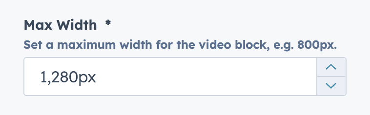
  <figcaption>Style → Max Width numeric input.</figcaption>
</figure>

### Aspect Ratio (Vimeo only)

Choose the aspect ratio for **Vimeo** videos (YouTube uses fixed 16:9):

- **16:9** — widescreen (default)
- **4:3** — standard
- **1:1** — square
- **9:16** — vertical/portrait

<figure>
  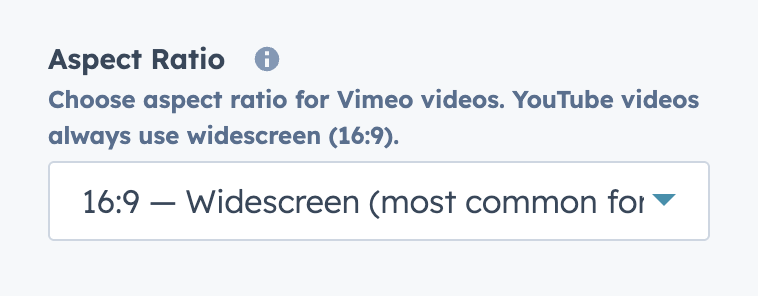
  <figcaption>Style → Aspect Ratio select for Vimeo.</figcaption>
</figure>

### Border Radius

Round the container corners (pixels per corner):

- **Top Left**, **Top Right**, **Bottom Left**, **Bottom Right**

<figure>
  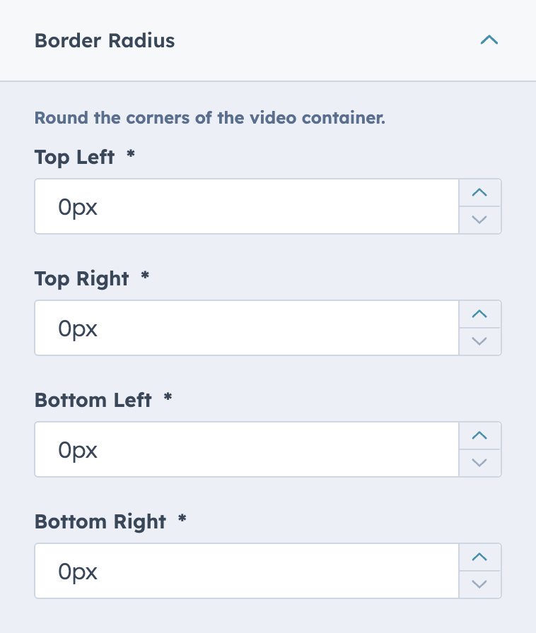
  <figcaption>Style → Border Radius grouped number inputs.</figcaption>
</figure>

### Alignment

Align the embed within its container: **Left**, **Center** (default), or **Right**.

<figure>
  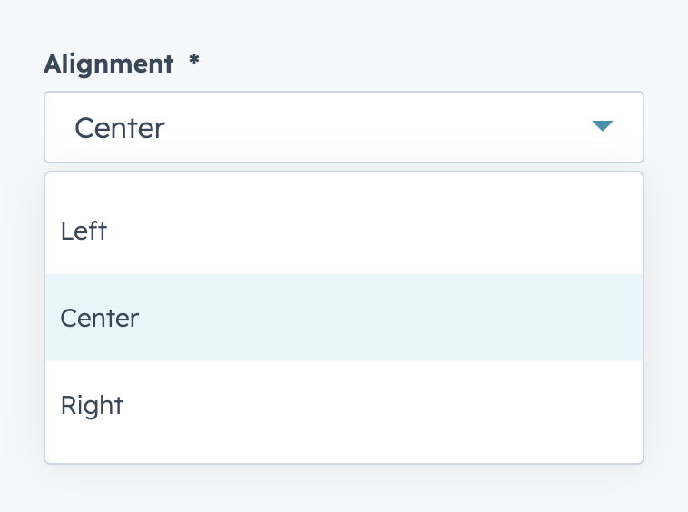
  <figcaption>Style → Alignment select.</figcaption>
</figure>

---

Looking to install this module?\
👉 [Get Lite Video Embed on the HubSpot Marketplace](https://app.hubspot.com/l/ecosystem/marketplace/modules/lite-video-embed-module-by-freshjuice)
