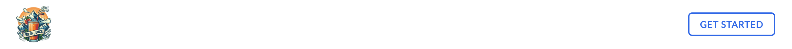
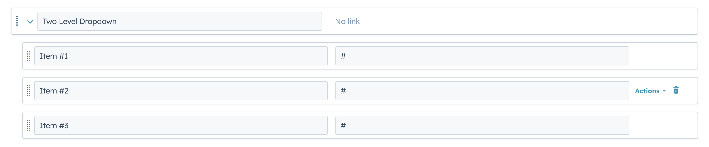
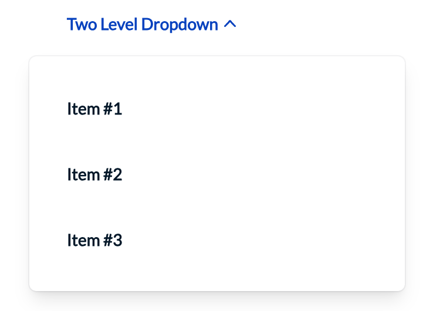
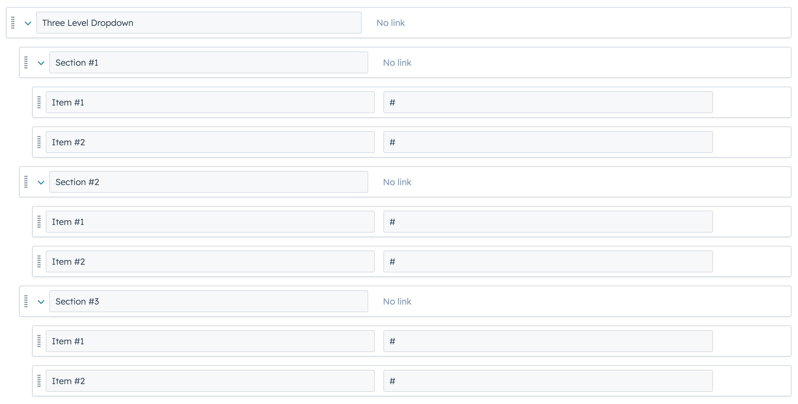
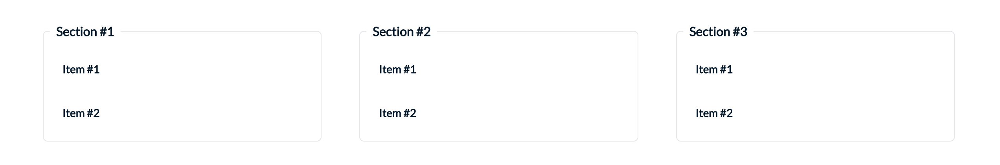

The Navigation Bar modules provide a simple way to display an interface with navigation for the site's pages or sections.

You can check the [demo page here](https://143910617.hs-sites-eu1.com/module-navigation-bar)

<figure>
  
  <figcaption>Navigation Bar Module</figcaption>
</figure>

<figure>
  
  <figcaption>Navigation Bar Simple Module</figcaption>
</figure>

We recommend using navigation bar simple module for landing pages or form pages.

## Global Settings
- **Logo**: The logo of your choice for your website.
- **Menu Layout**: A Choice between Classic and Modern (SuperB work in progress). Classic creates a two level dropdown level menu, while Modern creates a three level dropdown level menu. More details in the screenshots below.
- **Full Width dropdown menus?**: (Toggle) Option for dropdown to take the size of the container or the full width of the page. By default, it is toggled. Full width works only with menu layout Modern.
- **Menu**: Select the menu you want to display. You may choose to use the ones already available in the theme or create your own menu to use in this field.
- **Call to Actions**: Single Call to Action, having the following customisations:
  - **Style**: Choice for your button style. You can choose between the following:
    - **Plain Link**: Just a simple link, like any other menu links.
    - **Ghost Button**: A button with an outline and no background, on hovering, the background gets filled with the border's color.
    - **Primary Button**: The primary button style for call to action; Button with background with mouse over effect on hover.
  - **Title**: Text for the CTA button or link.
  - **Link**: The section for the url of the cta button / link. Link to specifies where exactly the link goes (External, file etc) and the URL field is where you insert your link. There is also an option for the link to open on a new window instead of the current.

Navigation Bar Simple Module does not have menu settings, having only a logo and CTA button/link.

## Navigation Bar Menu Settings

Our Standard Navigation Bar module allows for two different types of dropdown. The two level classic dropdown or a three level dropdown menu.

By pressing create new in the settings for **Menu**, you will be redirected to a new page where you may create your own menu.

Then, you may create a Two Level or Three Level Dropdowns in the Menu by stacking elements below one another.

If you want to use Three Level Dropdowns in your navigation bar, it is essential that you select "Modern" from settings in **Menu Layout**.

Additionally, it is good practice to have the first element (name) of the dropdown as "No Link".

<figure>
  
  <figcaption>Example for Settings of Two Level Dropdown</figcaption>
</figure>

<figure>
  
  <figcaption>Two Level Dropdown</figcaption>
</figure>

<figure>
  
  <figcaption>Example for Settings of Three Level Dropdown</figcaption>
</figure>

<figure>
  
  <figcaption>Three Level Dropdown</figcaption>
</figure>

