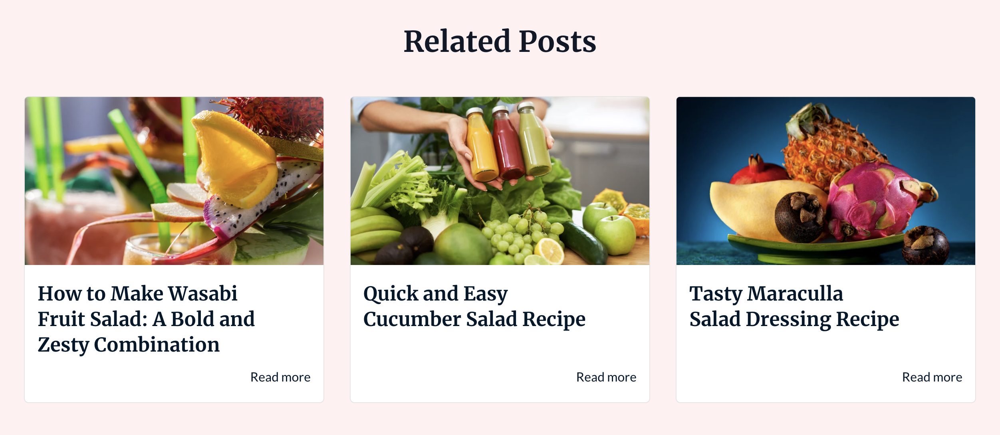

Related Posts module is used to display blog posts similar to the post you're at in the blog. Additionally, it can only be used in content type "BLOG_POST".

You can check the related posts module in action [here](https://143910617.hs-sites-eu1.com/blog/tangy-and-nutrient-packed-orange-spinach-salad)

## Settings
- **Layout**: Choose between Row or Column. Row makes this module full width and horizontal on the page, while column will have the module on the right side of the page near the blog content. Default value is Row.
