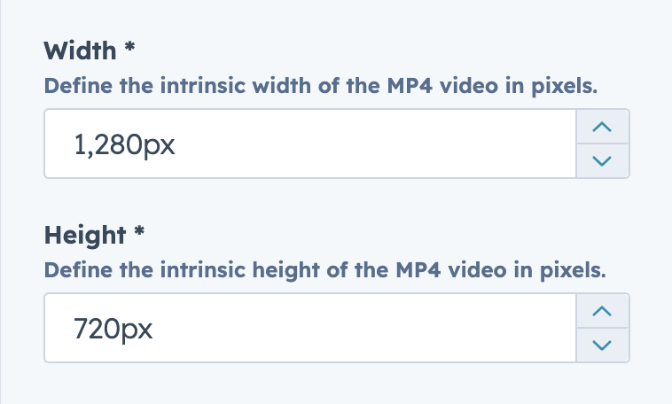

👉 [View module on HubSpot Marketplace](https://app.hubspot.com/l/ecosystem/marketplace/modules/video-gif-module-by-freshjuice)

The **Video GIF** module replaces heavy, pixelated GIF files with modern, lazy-loaded MP4 loops.
Showcase your products in high-quality, SEO-friendly animations without sacrificing performance.

👉 [View module preview](https://demo.freshjuice.dev/modules/video-gif) — see examples with different sizes, rounded corners, and poster images.

---

## Content tab (video setup)

### Video Source

- External: Paste a direct MP4 link (CDN, HubSpot Files, etc.)
- HubSpot: Select a HubSpot-hosted video asset.

#### URL / File

Paste your MP4 file link (External) or pick a HubSpot Video.
⚠️ For best results, keep files short, muted, and under 2 MB.

<figure>
  
  <figcaption>Sidebar Video Source dropdown and URL/File input.</figcaption>
</figure>

### Width & Height

Define the intrinsic video dimensions (in pixels).
The module auto-calculates aspect ratio for consistent rendering.

<figure>
  
  <figcaption>Sidebar Width and Height fields.</figcaption>
</figure>

### Poster Image (optional)

Upload a fallback image that displays while the MP4 loads or for very old browsers without video support.

<figure>
  
  <figcaption>Sidebar Poster Image upload.</figcaption>
</figure>

## Advanced options

Expand the **Advanced** group in the sidebar:

- **Custom CSS Class** — add extra classes for targeting or styling.

<figure>
  
  <figcaption>Sidebar Advanced settings.</figcaption>
</figure>

## Style tab

- Max Width — set the maximum width of the video block (e.g., 420, 960, 1280).
- Alignment — align video left, center (default), or right.
- Border Radius — apply rounded corners in pixels.

<figure>
  
  <figcaption>Style → width, alignment, and border radius.</figcaption>
</figure>

---

Looking to install this module?\
👉 [Get Lite Video Embed on the HubSpot Marketplace](https://app.hubspot.com/l/ecosystem/marketplace/modules/video-gif-module-by-freshjuice)
