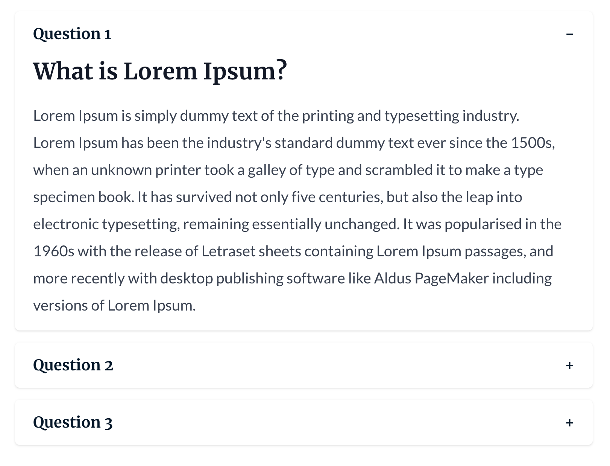

The Accordion module is a simple module that allows you to add a collapsable section with couple of questions and answers when clicked on a question. This module is very useful for instances where you might want to setup an FAQ section or page.

You can check the demo page [here](https://143910617.hs-sites-eu1.com/module-accordion)

## Settings
- **Questions**: A list of questions. For each question, you can set the following settings:
  - **Question**: The full question to be answered.
  - **Answer**: A rich text field for the answer to the question.
- **Enable FAQ Schema**: Enable this option to allow Markup in the module.
