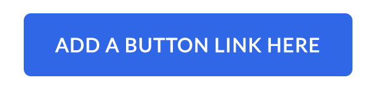

The Button module is a simple module that allows you to create a button with link.

You can check the demo page [here](https://143910617.hs-sites-eu1.com/button-module)

## Module Settings
- **Button Link**: The link for the call-to-action button. Includes additional settings such as:
  - **Link to**: (internal, external, email address etc.).
  - **URL**: The URL of the page you want to link to.
  - **Open link in new window**: (Toggle) Open link in a new tab.
  - **Link Type**: (Toggle) At the moment only option is No Follow, which by default is deactivated.
- **Button Text**: The text for the button.

## Styles Settings
- **Text**: You may select any font you want, size of the text and color. Additionally, you can make it bold, italic or underlined.
- **Background**: You can select a background color for the button along with its opacity.
- **Corner Radius**: Set the corners of the button to be more rounded.
- **Spacing**: Has abilities to set the margin above and below the button. Apart from this, you can also change the button's padding.
- **Alignment**: You can set the horizontal alignment of the button to left, center or right.
