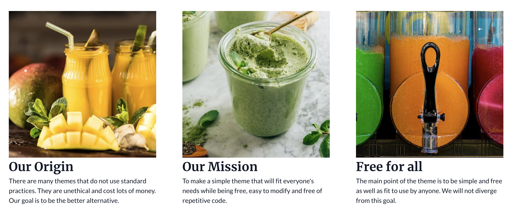

Multi Column Content Section is composed of three columns, each having an image along with rich text below the image for easy customisation.

<figure>
  
  <figcaption>Page Section: Multi Column Content</figcaption>
</figure>
