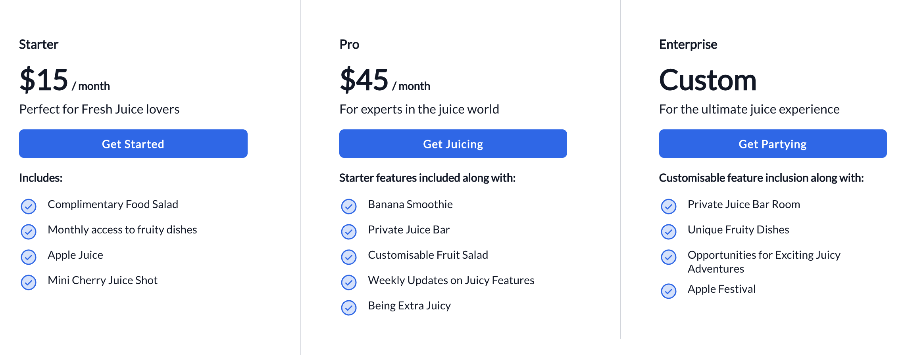

Pricing section uses the pricing cards module, which is a three column layout and is a way to display your pricing ranges for your subscriptions or products.

<figure>
  
  <figcaption>Page Section: Pricing</figcaption>
</figure>
