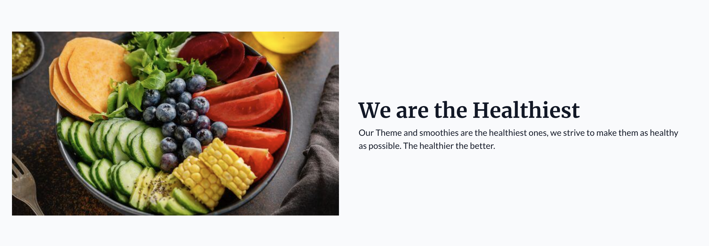
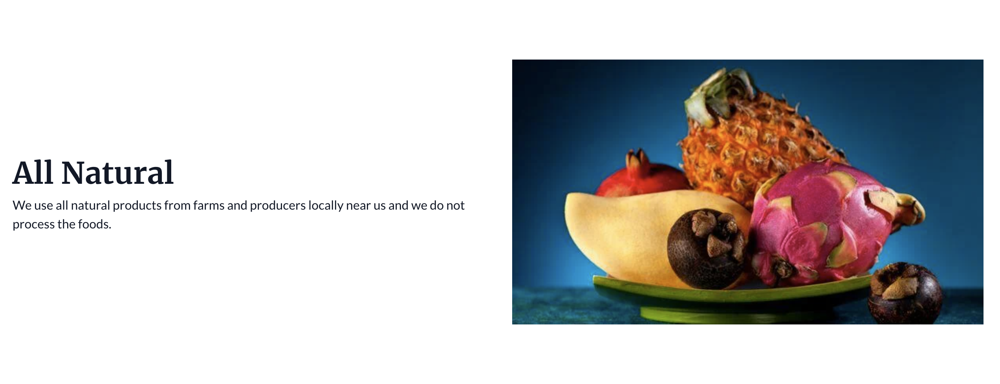

Row content section is used to display content in a two column layout, one of the columns being an image while another is rich text.

There are two types of row content arrangement: Row Content Image Left and Row Content Image Right.

<figure>
  
  <figcaption>Row Content Image Left Section</figcaption>
</figure>

<figure>
  
  <figcaption>Row Content Image Right Section</figcaption>
</figure>
