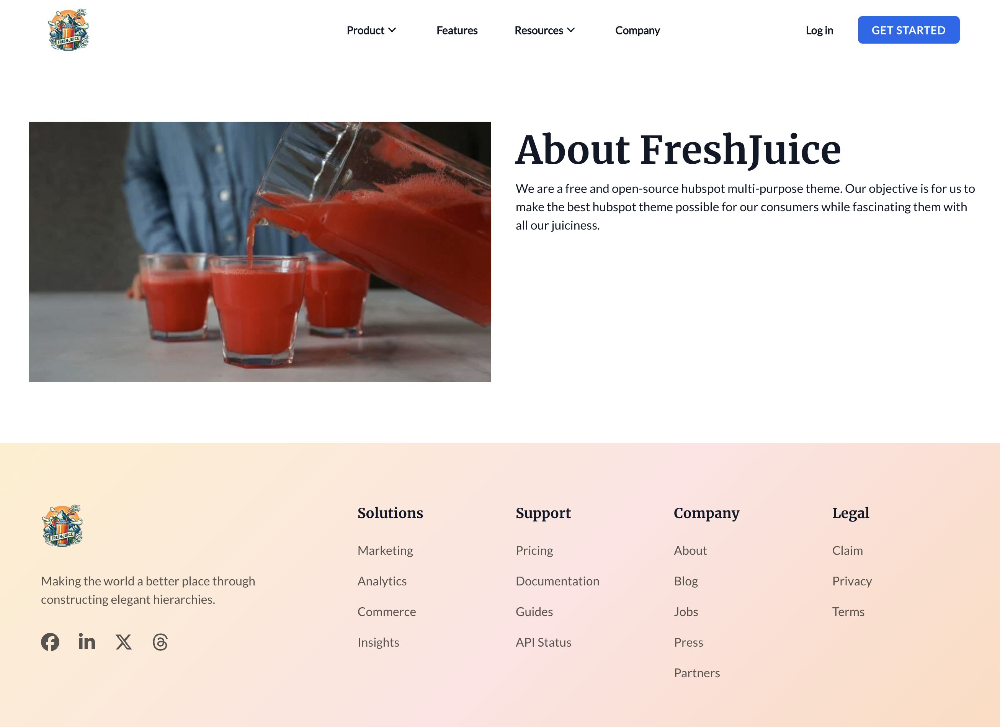

About template is used to create a page to display information about your company or product in a two column layout with an image and rich text.

<figure>
  
  <figcaption>Page for About Us</figcaption>
</figure>
