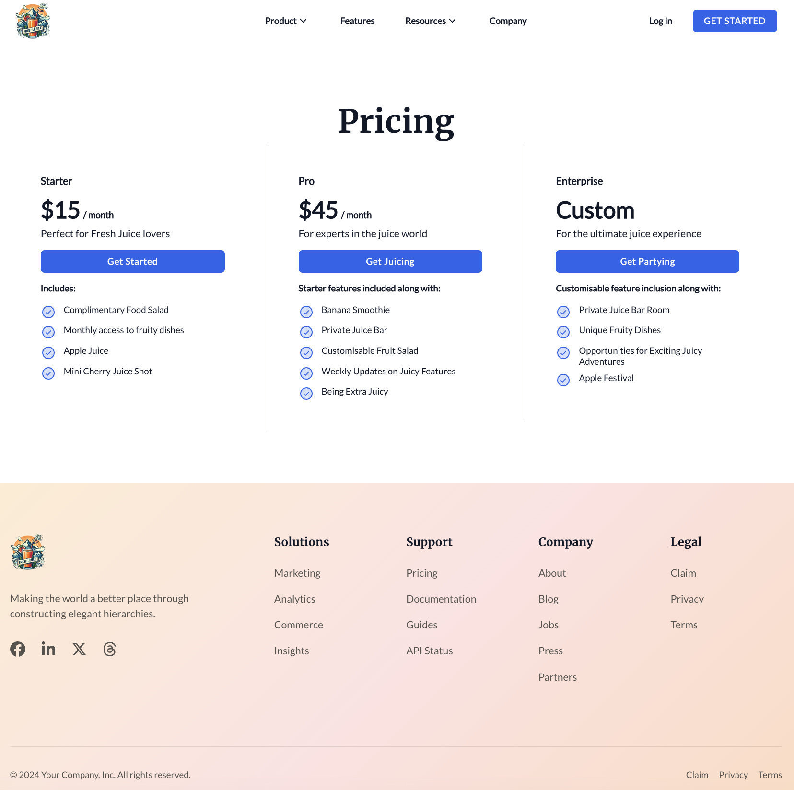

Pricing Template is used to display a page with three different pricing plans for a product or service.

The module used in the template can be modified to have only 1 or 2 pricing cards

<figure>
  
  <figcaption>Page for About Us</figcaption>
</figure>
