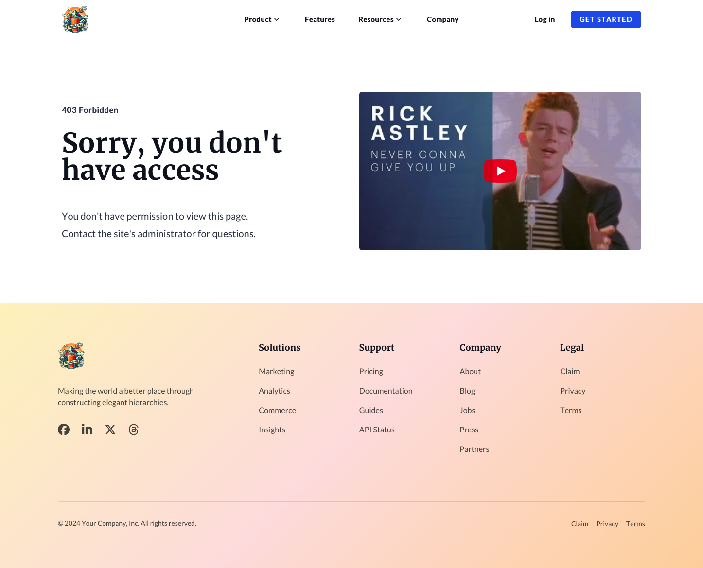
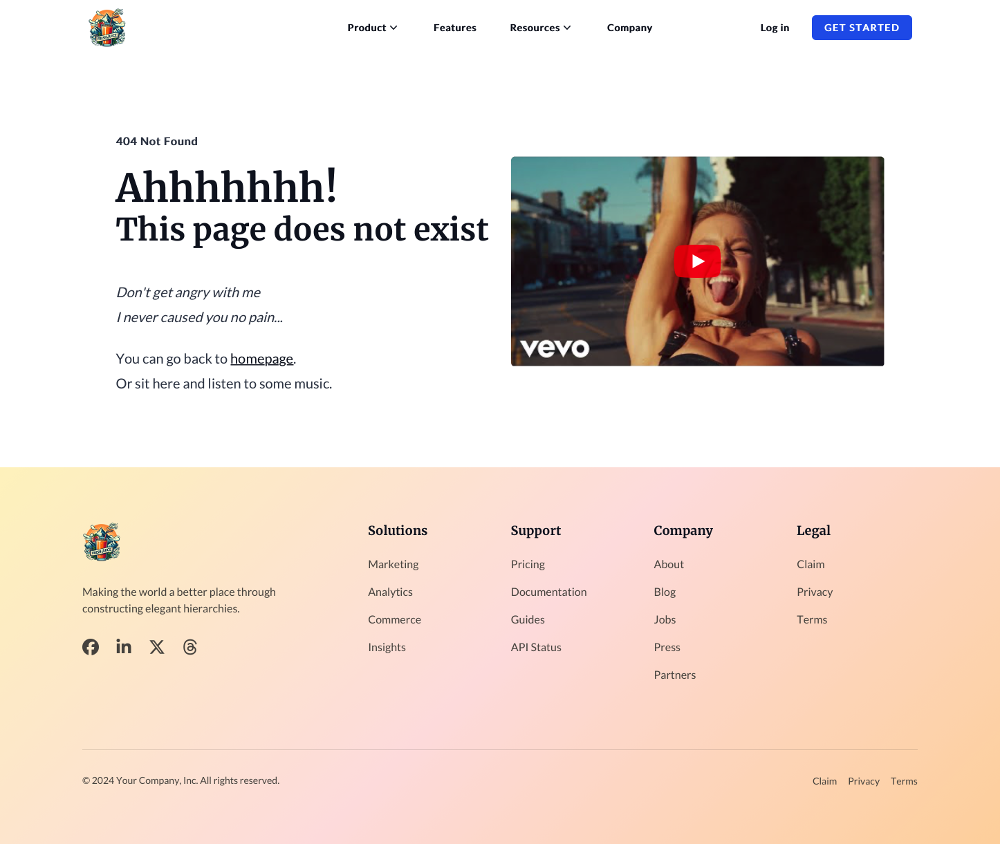
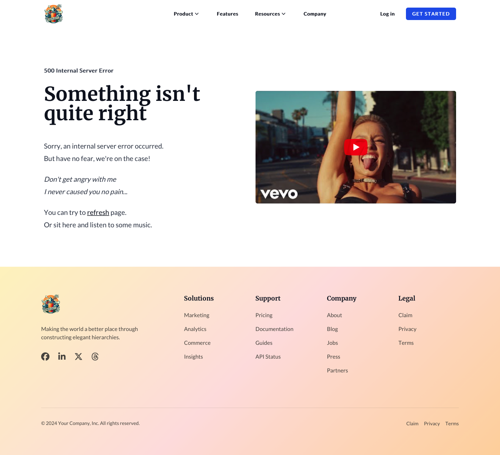

Here are all the different system templates in our Theme

## Email Subscriptions

Includes next templates: `Preferences`, `Confirmation`, `Backup-Unsubscribe`.

<figure>
  
  <figcaption>This is a caption for the image.</figcaption>
</figure>

<figure>
  
  <figcaption>This is a caption for the image.</figcaption>
</figure>

<figure>
  
  <figcaption>This is a caption for the image.</figcaption>
</figure>

---

## Private Content
### Registration
#### Registration Page
#### Access Denied

---

## Sign In
#### Sign In
#### Sign Out

---

## Password Reset
### Request Password Reset
### Create New Password

---

## Errors
### 404 Error Page
### 500 Error Page

---

## Password Prompt

---

## Search Results
