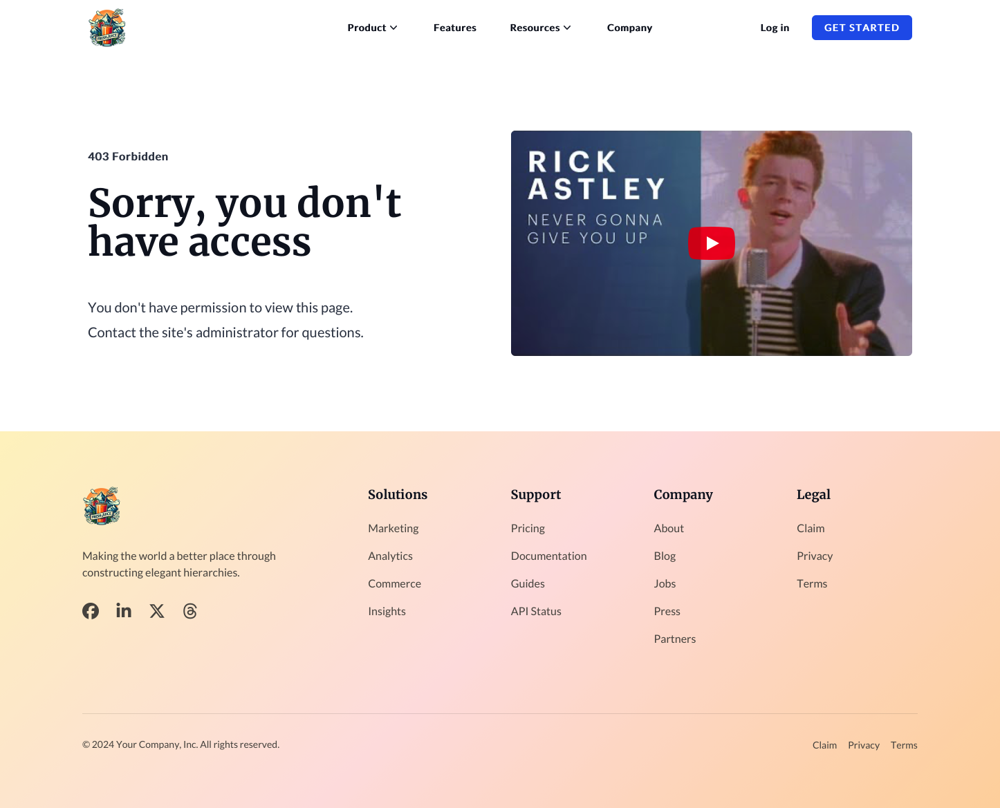
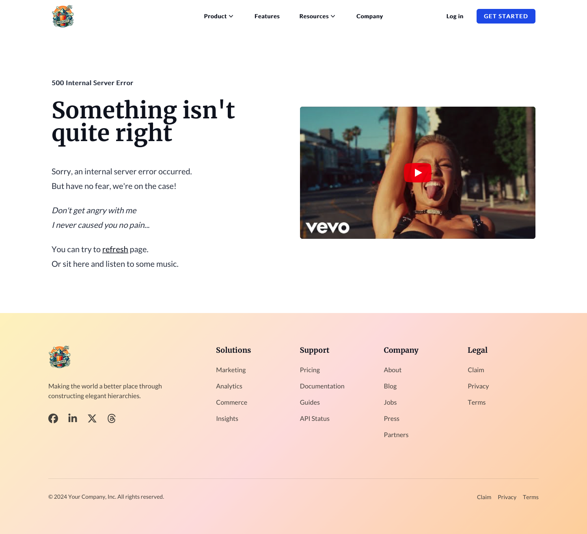

Here are all the different system templates in our Theme

## Email Subscriptions

Includes next templates: `Preferences`, `Confirmation`, `Backup-Unsubscribe`.

<figure>
  
  <figcaption>Page template: Subscription Preferences</figcaption>
</figure>

<figure>
  
  <figcaption>Page template: Subscription Confirmation</figcaption>
</figure>

<figure>
  
  <figcaption>Page template: Subscription Email Unsubscribing or problems</figcaption>
</figure>

---

## Private Content

Includes next template types: `Registration`, `Sign In`, `Password Reset`.

### Registration

Includes next templates: `Registration Page`, `Access Denied`.

<figure>
  
  <figcaption>Page template: Signing Up</figcaption>
</figure>

<figure>
  
  <figcaption>Page template: Access Denied to Private content</figcaption>
</figure>

---

### Sign In

Includes next templates: `Sign In`, `Sign Out`.

<figure>
  
  <figcaption>Page template: Signing In</figcaption>
</figure>

<figure>
  
  <figcaption>Page template: Signing Out</figcaption>
</figure>

---

### Password Reset

Includes next templates: `Request Password Reset`, `Create New Password`.

<figure>
  
  <figcaption>Page template: Reset Password Requesting</figcaption>
</figure>

<figure>
  
  <figcaption>Page template: Creating a new Password</figcaption>
</figure>

---

## System Pages

### Errors

Includes the next templates: `403 Error`, `404 Error`, `500 Error`.

<figure>
  
  <figcaption>Page template: 403 Error - Access is Denied / Forbidden</figcaption>
</figure>

<figure>
  
  <figcaption>Page template: 404 Error - Content does not exist</figcaption>
</figure>

<figure>
  
  <figcaption>Page template: 500 Error - Internal server error</figcaption>
</figure>

---

### Password Prompt

<figure>
  
  <figcaption>Page template: Requesting Password</figcaption>
</figure>

---

### Search Results

<figure>
  
  <figcaption>Page template: Search results</figcaption>
</figure>
